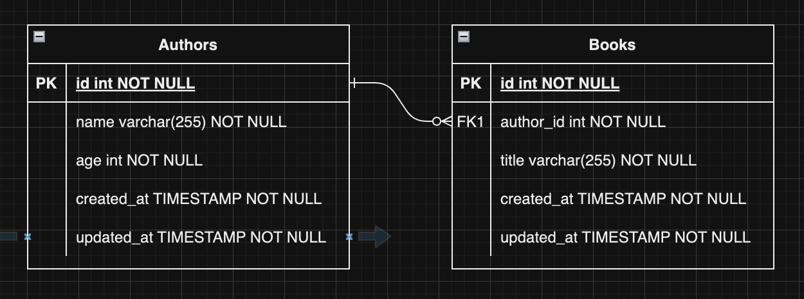

# sqlx-demo

This is a demo project for the blog post [title](link).

You can follow the tutorial from step 1 and master sqlx.

## Set up PostgreSQL with Docker

```bash
docker run --name sqlx-demo-postgres -e POSTGRES_PASSWORD=postgres -p 55432:5432 -d postgres
```

## Tables

In this tutorial, we will be using the following tables:


